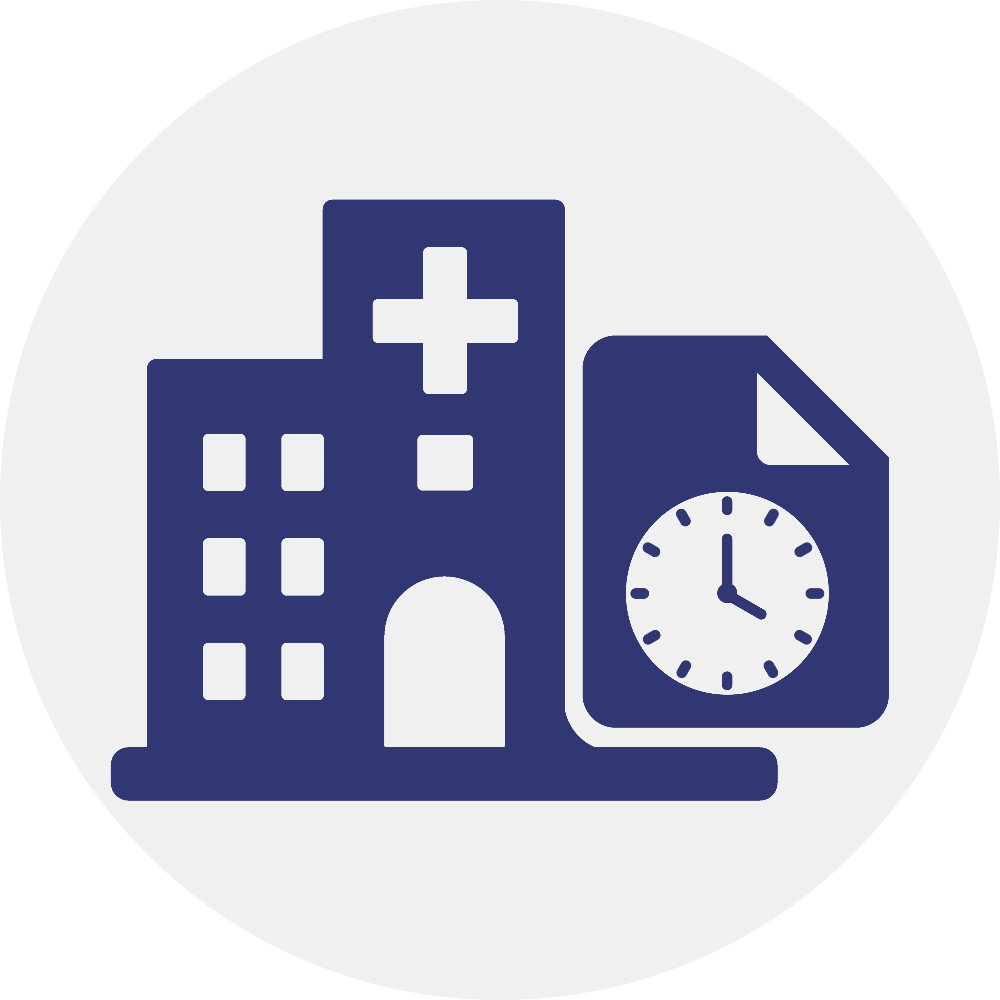

# MediXtract TimeTracker

A professional, local-first time-tracking application designed for MediXtract projects. It features a robust check-in/check-out workflow with automated synchronization via Google Drive for Desktop.



## 🚀 Features

- **Precise Tracking**: Start, Pause, Resume, and Save sessions with millisecond precision.
- **Google Drive Sync**: Implements a "Reload -> Modify -> Save" cycle to ensure data consistency across multiple users using Google Drive for Desktop.
- **Rich Dashboard**: Real-time statistics including total time, session counts, and top projects.
- **Session History**: Comprehensive history view with multi-column filtering (Date, Project, User, Task Type).
- **Data Portability**: Export your tracked data to CSV for reporting or invoicing.
- **Aesthetic UI**: Modern dark/light mode interface with dynamic animations (including a submerged aquarium effect).

## 🛠 Tech Stack

- **Frontend**: Vanilla HTML5, CSS3 (Modern variables & Flexbox), and Modern JavaScript (ES6+).
- **Storage**: Local JSON persistence with optional Google Drive cloud synchronization.
- **Server**: Lightweight local hosting via `npx serve`.

## 📦 Getting Started

### Prerequisites

- **Node.js**: Required to run the local development server. [Download Node.js](https://nodejs.org/)

### Installation & Launch

1.  **Clone the Repository**:
    ```bash
    git clone https://github.com/your-username/TimeTracker.git
    cd TimeTracker
    ```

2.  **Create a Launch Shortcut**:
    Navigate to `assets/documents/` and run:
    - `create_shortcut.bat` (Windows)
    
    This will create a `TimeTracker.lnk` shortcut in the project root.

3.  **Run the App**:
    Double-click the **TimeTracker.lnk** shortcut. This will:
    - Start a local server at `http://localhost:2604`.
    - Automatically open the application in your default browser.

## 📂 Project Structure

- `index.html`: The main entry point (Single Page Application).
- `css/`: Stylesheets including variables, base styles, and app-specific layouts.
- `js/`: Application logic split into storage management, UI handling, and utility functions.
- `assets/`: 
  - `images/`: Logos, icons, and background illustrations.
  - `documents/`: Project documentation and the shortcut creation script.

## 🔐 Data & Security

The application follows the **MediXtract Schema Editor** architecture:
- **`main_TT/`**: Stores the active `main.json` source of truth.
- **`security_copies_TT/`**: Maintains timestamped backups of every change to prevent data loss.

---
*Created by the MediXtract Team.*

## 📬 Contact

For support, feedback, or inquiries, please contact:
- **Poltor Programmer**: [poltorprogrammer@gmail.com](mailto:poltorprogrammer@gmail.com)
- **MediXtract Developers**: [medixtract.developers@gmail.com](mailto:medixtract.developers@gmail.com)
